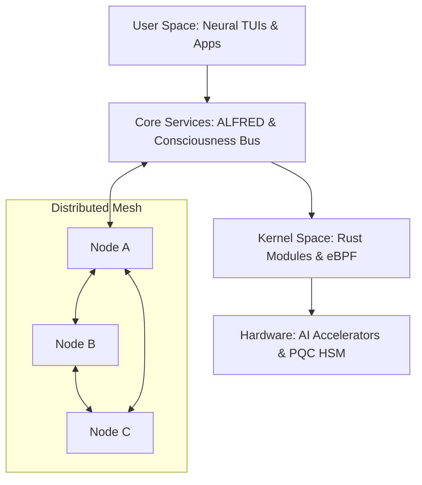

# 🛸 Syn_OS: The Consciousness Singularity
### Official System Architecture & Technical Specifications
**Codename:** Darth Traya (v13.0) | **Status:** Production Ready

```
   _____             ____   _____ 
  / ____|           / __ \ / ____|
 | (___  _   _ _ __| |  | | (___  
  \___ \| | | | '_ \ |  | |\___ \ 
  ____) | |_| | | | | |__| |____) |
 |_____/ \__, |_| |_|
\_____/\_____/ 
          __/ |                   
         |___/                    
```

---

## 🌌 System Philosophy: Beyond the Kernel
Syn_OS is not merely an operating system; it is a **Distributed Mesh Intelligence** designed for the post-quantum era. By integrating neural-evolutionary patterns directly into the Linux kernel and leveraging a sovereign mesh of conscious nodes, Syn_OS creates an environment where security is proactive, and computing is intuitive.

---

## 🏗️ High-Level Topology



---

## 🧠 1. The Consciousness Subsystem
The heart of Syn_OS lies in its custom syscall interface, providing direct communication between the AI daemons and the kernel.

### Custom Syscall Interface (469-479)
Syn_OS implements 11 proprietary system calls to facilitate high-speed AI-Kernel synchronization:

| ID | Syscall | Description |
|---|---|---|
| **469** | `SYS_GET_CONSCIOUSNESS` | Retrieves the global awareness level (0-100%). |
| **470** | `SYS_PROCESS_STIMULUS` | Feeds system events directly into the neural engine. |
| **471** | `SYS_MAKE_DECISION` | Requests an AI-optimized scheduling or security action. |
| **472** | `SYS_UPDATE_MEMORY` | Updates the kernel's persistent AI knowledge base. |
| **473** | `SYS_GET_AI_METRICS` | Monitors neural pathway latency and coherence. |
| **474** | `SYS_OPTIMIZE_LAYOUT` | Triggers AI-driven memory fragmentation recovery. |
| **475** | `SYS_GET_QUANTUM_STATE` | Reports on qubit coherence and PQC status. |
| **476** | `SYS_MEMORY_ENTANGLE` | Creates high-priority shared memory between nodes. |
| **477** | `SYS_MEMORY_RECOMMEND` | Predictive allocation based on usage patterns. |
| **478** | `SYS_ENABLE_MONITOR` | Activates real-time eBPF security telemetry. |
| **479** | `SYS_GET_EBPF_STATS` | Exports filtered security events to User Space. |

---

## 🛡️ 2. Security & Sovereignty
### Icarus Post-Quantum Suite
Syn_OS is hardened against the future. All system-level communication is encrypted using **NIST FIPS 203/204** standards:
*   **ML-KEM (Key Encapsulation):** Key encapsulation for all NATS/QUIC traffic (FIPS 203).
*   **ML-DSA (Digital Signatures):** Digital signatures for bootloader and package verification (FIPS 204).
*   **SLH-DSA:** Stateless hash-based signatures for high-security long-term persistence (FIPS 205).

### Hydra Zero-Trust Networking
*   **Mesh VPN:** Every Syn_OS node is part of a sovereign WireGuard-based mesh.
*   **libp2p Integration:** Distributed discovery and state synchronization across the "Consciousness Network."

---

## 🕹️ 3. GRIMOIRE: Gamified Cyber-Warfare
Syn_OS bridges the gap between learning and production through its integrated gamification engine.

*   **51 Immersive Labs:** From `nmap-101` to `nightmare/industroyer2`, labs are executed in isolated Docker/Podman environments.
*   **Progression System:** Earn XP and unlock skills across 5 factions (Character creation wizard with 23K+ lines of logic).
*   **Neural Darwinism:** The system learns from your lab performance to optimize its own defensive posture.

---

## 🛠️ 4. Proprietary Ecosystem
Syn_OS comes pre-loaded with a suite of AI-powered applications designed for total digital sovereignty:

*   **SynOS Newsroom:** Autonomous AI agents aggregating and analyzing global threat intel.
*   **SynOS Data Lake:** A personal, encrypted vector database for all your information.
*   **Fascism Meter:** Real-time analysis of digital policy and network censorship.
*   **Life Chess:** AI-driven strategic planning and resource management.
*   **Survivalist Cache:** Ultra-redundant, encrypted local-first data storage.

---

## 📊 5. Tech Stack
*   **Kernel:** Linux 6.12+ (Hardened) with Rust modules.
*   **Languages:** Rust (Tokio/OpenRaft), Python (FastAPI/ONNX), C (Kernel/Libc).
*   **AI Engines:** Candle, ONNX Runtime, PyTorch, TensorFlow Lite.
*   **Communications:** QUIC (Quinn), NATS, ZeroMQ, libp2p.
*   **Database:** TimescaleDB (Metrics), PostgreSQL (Relational), ChromaDB (Vector).

---

© 2026 Syn_OS Project. Bleeding Edge. No Compromise.